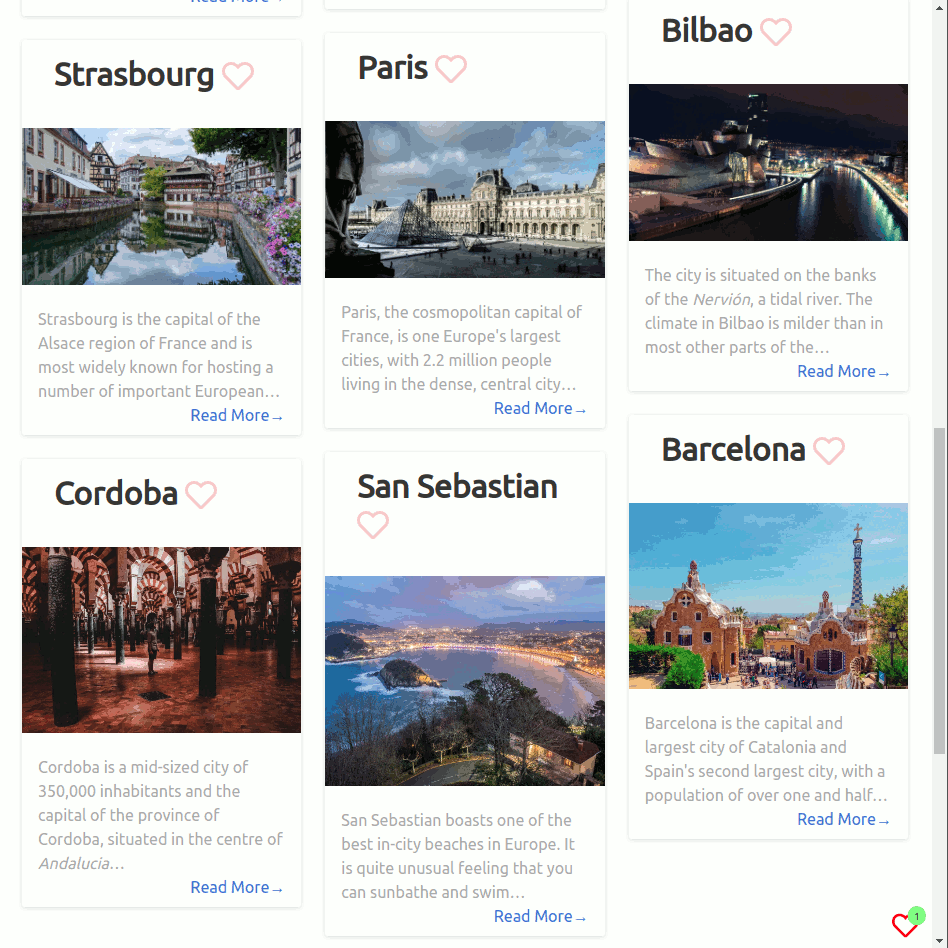

# Using _Wish to go_

1. Install the plugin in your blog.

2. **Click on the Hearts to add Destinations to the _Wish To Go List_.**

	

	As your readers bookmark your destinations, they start building a destination wish list.

3. **Plan a Trip from Destinations in the _Wish To Go List_.**

	

	Your readers can plan their holiday trip based on the liked destinations.
