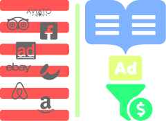

## Boost Travel Blog Monetization

### Relevant Advertisements to Boost Monetization

Don't bloat your site with non-related adverts, readers hate it. Use a clever advertisement approach to **monetize your travel site**. Show ads only when the traveller is ready to buy. The Trip Planner is where affiliate marketing rocks:

- Traveller can book lodging, trips and tours from the Trip Planner
- No cookie expiration worries. Your reader will purchase immediately from the Trip Planner.
- Don't bother your readers with spam. **Target visitors** only when the booking or products that you offer are **relevant to them**.

[Read More→](/travel-blog-monetization/how-to-improve-affiliate-marketing)
