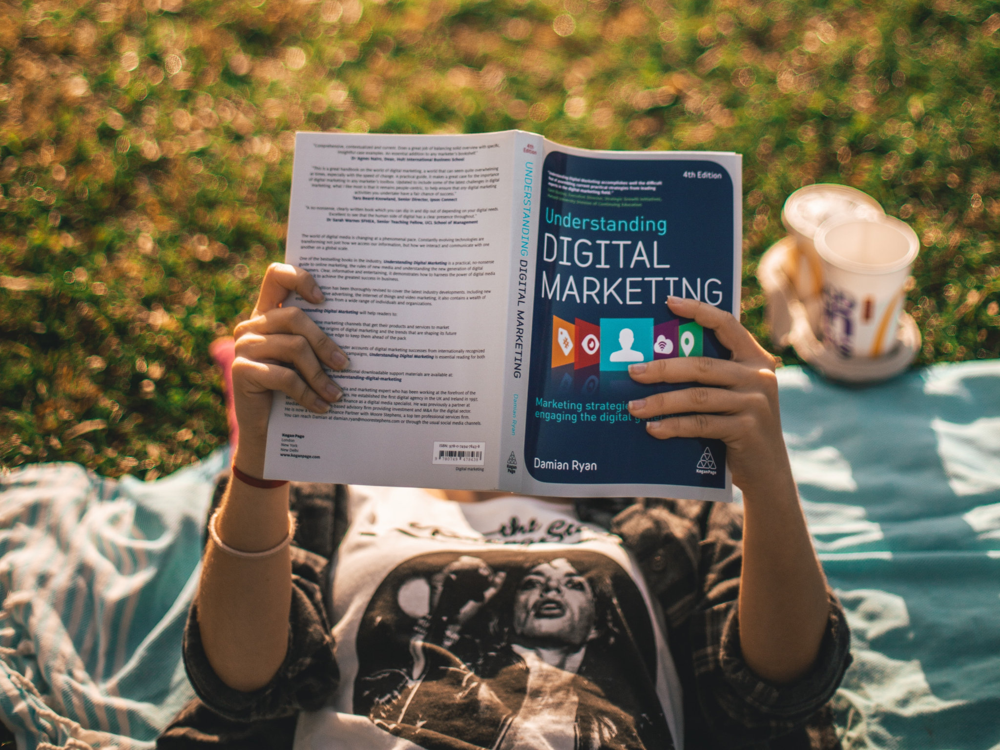
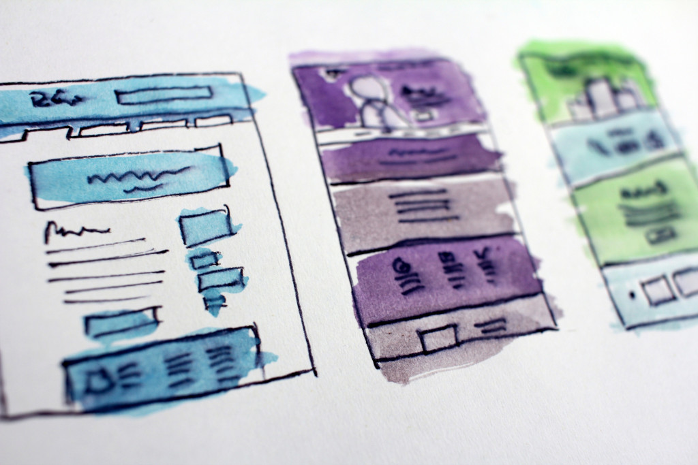

# How to Improve Your Travel Blog Affiliate Marketing? (5 Must Do Steps)

Some years ago, I discovered a YouTube channel talking about SEO and how to make money from the audience visiting webpages. One of the videos showed that even some small traffic bloggers could afford to earn some money from what it was new to me, **Affiliate Marketing**.

At that time, I was working on a tour business development in Bangkok. At first, maybe because the hot and sticky weather of Thailand's Capital didn't let me think clear, I thought that the video was useless for my purposes to increase traffic to promote my site. But the magic of YouTube came in and started showing more and more videos about affiliation sales.

After cooling down my brain, I realized that I could offer an affiliation program, so the bloggers talking about my business could get a commission. A great way to promote sales of my business. The business failed some time later but I learned a lot about blog monetization.

## Affiliate Marketing for Travel Sites

If you are new to blogging or never tried to monetize your travel blog, you probably are lost the same way as I was lost when I saw that _search engine optimization_ video. But don't worry, I will try to explain it. In case that you already know what is an affiliate program, you can skip to the next entry.

Being short, _affiliate marketing_ is a way to earn commissions by diverting traffic from your site to a third party website that offers goods or services. If a visitor that you sent to them buys something, then you get the commission. Nowadays, most electronic marketplaces offer some kind of affiliate programs to have free advertisement from bloggers, influencers or other social media actors. _Amazon_ was a pioneer in this field. The increasing expenses on internet advertisement, the difficulty to stay at the top of search engine listings and the huge product catalogue, pushed the first electronic market actor to launch their affiliate programme called _Amazon Associates_.

Jeff Bezos and his team realized that they could not afford to advertise their whole product portfolio. Then they decided to use [Wikinomics](https://amzn.to/2wNkd67) (the economy based in cooperative collaboration) and enrol a silent legion of sellers, mainly bloggers at that time. _Amazon_ offers their affiliates a commission of the customer purchase in case the blogger owner, influencer or whoever is able to derive traffic to _Amazon_ electronic shop.

The idea worked very well, _Amazon_ got free advertisement and the bloggers could earn money from the commissions. It worked so well that now many companies use this strategy to sell their products.

Travel industry is not an exception. With the irruption of flight comparators, hotel booking services and tour dealers on the internet, the fighting for the first places in _Google_ search results became fierce. The solution to save money on advertisement and SEO was to implement affiliate programs in the same way _Amazon_ did in the past.

_eMarketer_, an internet research institution, estimates that the travel industry sales on the internet will reach the €700 billion by 2021 at a 7% annual growth. Those figures and the difficulty of online advertising mentioned above, lend companies such as _Booking.com_ or _Skyscanner_, just to mention a couple, to launch their own affiliate packages.

## How the Affiliate Links work (from the publisher point of view)

You are called _the publisher_ in this world. The travel blogger who is trying to get a few bucks from the huge effort put on their posts, is called the publisher. For you, it is quite easy to join the affiliate program and start making money from the commissions that you will earn. The _advertisers_, the guys on the other side; those giving you the commission, will do everything very easy for you. They will provide a sort of link codes and widgets that you can insert in your website. Have a look to James Clark article to have a more detailed description on [how affiliate programs work](https://www.travelbloggersguide.com/a-guide-to-affiliate-marketing-for-travel-blogs/).

## What are the rules (from the advertiser point of view)

You are the small fish here and the rules are set by the advertisers. The rules can vary depending on the affiliate program that you have chosen. Anyway, there are common aspects that you should be aware. I will not talk about legal nor economic aspects; it is not my field. I will talk how the commission is attributed to whom.

### The Bitter Cookie

Everybody should know by now what a cookie is. A cookie is used to leave a mark in the visitor's browser with a piece of coded information. The affiliate links and widgets use a cookie to track where the traffic is coming from. The cookie holds your affiliate membership code and the expiry date. When the cookie expires, the _advertiser_ will stop attributing sales to you. Beware that some programs do not use cookies for tracking. I will talk about this later.

Let's analyse a typical scenario that happens when a visitor of your travel blog clicks on an affiliate link. After the reader takes action and clicks the link or button, the browser is redirected to the _advertiser's_ website. The URL holds a code that identifies your blog. When you have been identified, the _advertiser's_ site will leave a cookie with your id and an expiry date. If the reader buys something during this session you are lucky; you've got your commission. But if the reader leaves the session, by closing the browser or going to another page, someone else can get your commission. 

The most evident happens when the cookie expires. An expired cookie doesn't entitle you for any revenue. Cookie live periods change depending on the _advertiser's_ polices; their rules. Some require the user to buy during the same session to entitle you for a commission. In this case, you can think that you don't have a cookie, meaning that if your reader doesn't buy at the moment that you sent her/him to the _advertiser's_ pages, you will not get a single penny. Others can set expiry periods of a week or a month. This means that, if your readers get back to the _advertiser's_ site and buy something even without visiting you site in that session, you will get the commission.

The later case looks fair, because the _advertiser_ respects your effort to divert traffic to him, giving you a grace period. But, what happens if your reader visits another blog that implements an affiliate program with the same _advertiser_? Bad news. The majority of programs use a last cookie grants the commission. This is so because it is difficult to stablish a shared commission scheme. You can always be on the bright side of life and think that you will be the last!

## How to Optimize Affiliate Conversion Rate?

To improve your affiliate conversion ratios, i.e. make money from you travel blog affiliate links, you have to think about how the rules of the _advertiser_ guys work, but also use a bit of neuromarketing and understand when your readers are ready to buy.

### 1. Be Relevant on What you Offer

Being relevant is a constant in the digital world. To gather attention from your readers, you need to be relevant to their tastes. To scale on _Google_ search engine, your posts have to be relevant to the user search intention. To increase your affiliate income, the products that you offer should be relevant to the article you are writing.

When you are writing a post about the white sand beaches in the Andaman Sea, it gets unnatural to offer a set of fancy suitcases. But if your article is about the gear you take on your trips, it makes sense that you put an affiliated link to the shop where you bought your last travel bag.

By being relevant, your readers will be more confident to buy from your site because they will have the perception that you are sharing with them what you like, use or buy.

### 2. Do not Bloat your Pages with Adverts

You should always remember that your readers go to your site to read your articles and learn new things. They don't go shopping. When the visitors feel that you are trying to sell them more than offer good content, you are at the risk to lose them forever. Therefore, you have to be careful and choose the proper balance on the number of adverts that you show in each page in your blog.

Again, being relevant will be useful to convert your sales from affiliate links. If you do well, an affiliate link will not be perceived as an advert and your readers will be happy to spend money and help you.

### 3. Know when your Readers are Ready to Buy

This is the tricky part but **if you master it, your affiliate link income will soar**.

Any marketing handbook says that you cannot sell if the customer is not ready to buy. It is quite obvious, but many marketers forget about this fact. There are many reasons why customers are not ready to buy but let's focus on your readers. 

Your readers are travellers and you can think on several factors that make them to postpone the decision to start a trip. Lack of time or money are the main obstacles. But your readers are also dreamers and despite they don't have time or money, they will keep reading your posts in the hope that they could afford to travel in the future. With this _customer_ profile, it makes very difficult to forecast when a reader will be ready to travel.

Another reason why you should know when your visitor is ready to travel, on top of the generic marketing reasons, is the _bitter cookie_. As I said above, if the reader visits the affiliate website well before decides to buy, your cookie will be expired or another blogger will have acquired the _last to arrive_ condition and your commission will vanish.

You may think that it is impossible to know when your readers are ready to travel having only, as much, their email addresses. But in fact there are several ways to know it at least from some of them.

- Reading the visitor's comments.

  Many readers start to ask questions about the destinations they want to visit just before they are going to travel. Many others only read the comments when are ready to travel looking for third party opinions. Do not hesitate to answer the comments and add affiliate links to the hotel where you stayed or the tour you took there. They trust you and they would like to stay at the same place that you stayed before.

  This strategy is outlined by Lauren Juliff in [this excellent article about funding travel blogs](https://www.neverendingfootsteps.com/how-to-fund-travel-blog).

- Using a tool to recognize readers intention.

  A tool in the form of a plugin or a piece of code that you insert in your pages can help to find when your reader are willing to travel. You can use [Wish To Go](https://wish-to-go.com/subscription/?plan=backpacker) to guess when your readers are ready to travel. This plugin also offers affiliate links for flights, hotels and tours only when they have decided to book. *Wish To Go* is a free tool that includes a heart widget. The readers can click on the heart in the same way they like pictures on _Instagram_. You can insert this widget in any part of your post and it will, when clicked, add the destination in your post to a kind of electronic bucket list. When your readers are ready to travel, they can use the included travel planner widget to start planning the trip from the bucket list that they created some time ago by clicking on the hearts. When your visitors start planning, that means that they are ready to travel. As I mentioned above, the plugin allows booking flights, hotels and tours from the data in the trip planner. Therefore, the affiliate link are relevant to your visitor and appear just when she/he is ready to buy. Moreover, the plugin lets you to compile lists of readers that are planning a trip by destination and email. So then, you can launch pertinent and focussed mailing campaigns that will not end in the spam folder.

  You can try the plugin for free [here](https://wish-to-go.com/subscription/?plan=backpacker).

### 4. Choose Few Affiliate Programs

There are plenty of affiliate marketing programs out there. This fact can be overwhelming at the beginning and make difficult a simple selection. Just don't be tempted to offer several programs to your readers, so they can freely use any of them.

By doing that, you are putting your readers on stress. Believe me. Our brains get stressed when they have to choose. An interesting experiment based on the ideas of the book [Paradox of Choice](https://amzn.to/2TToRHP), can be found [here](https://neilpatel.com/blog/too-many-choices/).

Despite stressing your customer's brain, showing too much affiliate links or widgets will lead to the same problems of [bloating your pages with adverts](#2._do_not_bloat_your_pages_with_adverts).

Choose one program for each area and have one as a backup. You can have one for booking flights, other for hotels, for tours, etc. But choose the ones with proven reputation. You don't want your readers book a flight from your travel blog and find the flight they bought does not exist.

### 5. Don't be Cheeky

I'm pretty sure you are not. If you have developed a community of followers, that means that you are honest. But, in desire to divert as much traffic as possible to and affiliate site, you can be tempted to hide your affiliate links under unrelated button, images and other black hat strategies that can report benefits on the short term but can ruin your reputation in the long run.

Do not risk your readers confidence for a few bucks. Tell them that you get a commission if they click on some links and explain that they help you to keep going with their favourite travel blog.

I'm sure that you have realize that the book and the plugin links are affiliate links. 

## Bottom Line

Affiliate marketing can be a good way to monetize your travel blog. If you follow the guidelines above, you have half of the way done. Now you should experiment by yourself and try to figure out what your readers like and how they buy. It is time for you!

Here is the [YouTube channel talking about SEO](https://www.youtube.com/channel/UCytOqtKYpACcWMD14UjhSeQ) that I talk above.

## Further Reading

The article below highlights the benefits of instaling a **Destination Wish List** _plugin_ in your blog, in special how it can help to boost traffic site.

[A Travel Bucket List for your Travel Site](/travel-blog-monetization/destination-wish-list-for-your-travel-blog/)

The following link relates the story of Joanna, an eager travel blog reader. 

[Let Joanna fall in Love with Your Travel Blog](/stories/joanna/)